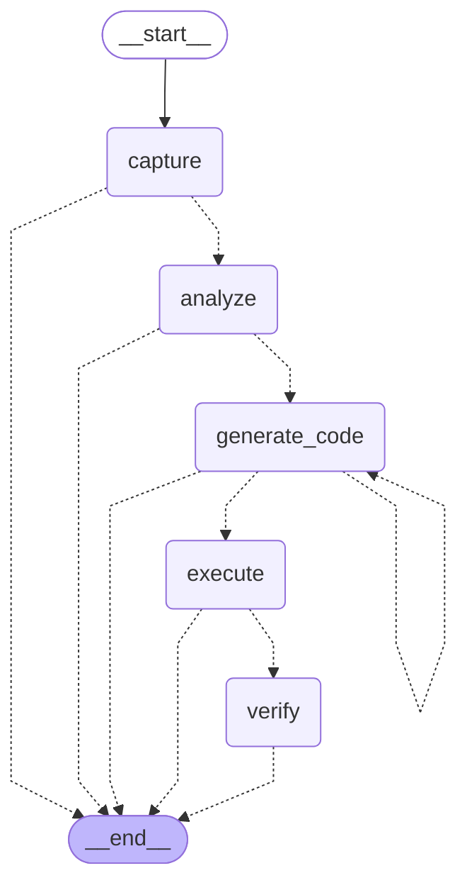

# LangGraph 工作流可视化

## 当前 Android Agent 工作流图

以下是 test_tools_lg.py 中定义的工作流结构：

## 节点说明

1. **capture** - 捕获屏幕截图和 UI 状态
2. **analyze** - 分析屏幕内容，提取商品列表
3. **generate_code** - 生成执行代码
4. **execute** - 执行生成的代码
5. **verify** - 验证执行结果

## 流程特点

- **实线箭头** (`-->`) 表示固定的流程路径
- **虚线箭头** (`-.->`) 表示条件路由，根据状态动态决定
- **循环** `generate_code -> generate_code` 表示代码生成失败时的重试机制
- **多出口** 每个节点都可能直接到达 `__end__`，实现灵活的流程控制

## 如何查看

你可以使用以下工具查看这个图表：

1. **在线工具**: 复制上面的 Mermaid 代码到 https://mermaid.live
2. **VSCode**: 安装 Mermaid 插件后可以预览此 md 文件
3. **Typora**: 原生支持 Mermaid 图表渲染
